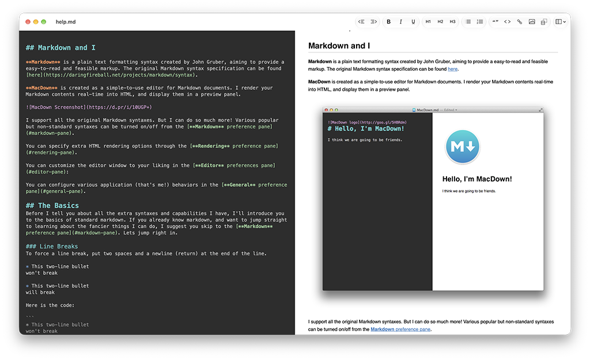

# MacDown

**A free, open source Markdown editor for your Mac.** Write Markdown on the
left and watch the formatted page appear on the right as you type.



## Install

With [Homebrew](https://brew.sh):

```sh
brew install --cask levous/tap/macdown-swift
```

Or download `MacDown-<version>.zip` from the
[latest release](https://github.com/levous/macdown-swift/releases/latest),
unzip it, and drag `MacDown.app` into your Applications folder.

MacDown needs macOS 15 or later. Once it's open, **Help ▸ MacDown Help** walks
you through everything it can do.

## What you can do

- **See your writing as you go.** A live preview of standard Markdown:
  headings, lists, tables, task lists, footnotes, code and more.
- **Write code and math.** Code blocks are colored in hundreds of languages,
  and math renders with MathJax.
- **Draw diagrams.** Mermaid and Graphviz diagrams render right in the
  preview.
- **Type less.** Lists and quotes continue when you press Return, brackets
  and quotes close themselves, and the toolbar and shortcuts apply formatting.
- **Make it yours.** Pick an editor theme and a preview style, or add your
  own.
- **Share it.** Export to HTML or PDF, or print.
- **Work from the terminal.** `macdown file.md` opens a file, and you can pipe
  text in. Homebrew installs the `macdown` command for you; otherwise, link it
  with:

  ```sh
  ln -s /Applications/MacDown.app/Contents/SharedSupport/bin/macdown /usr/local/bin/macdown
  ```

## Learn more

- [How MacDown is built](docs/ARCHITECTURE.md), including building it from
  source and contributing.
- MacDown is a Swift rewrite of the original
  [MacDown](https://github.com/MacDownApp/macdown); installing it replaces the
  original. [What's kept and what changed](docs/MACDOWN-PORT.md).

## License

MacDown is released under the MIT license; see `LICENSE`. Third-party
licenses are in `Licenses/`.
