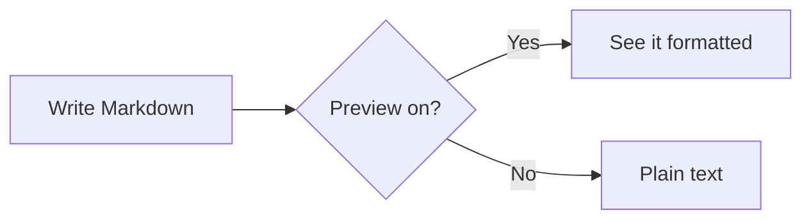
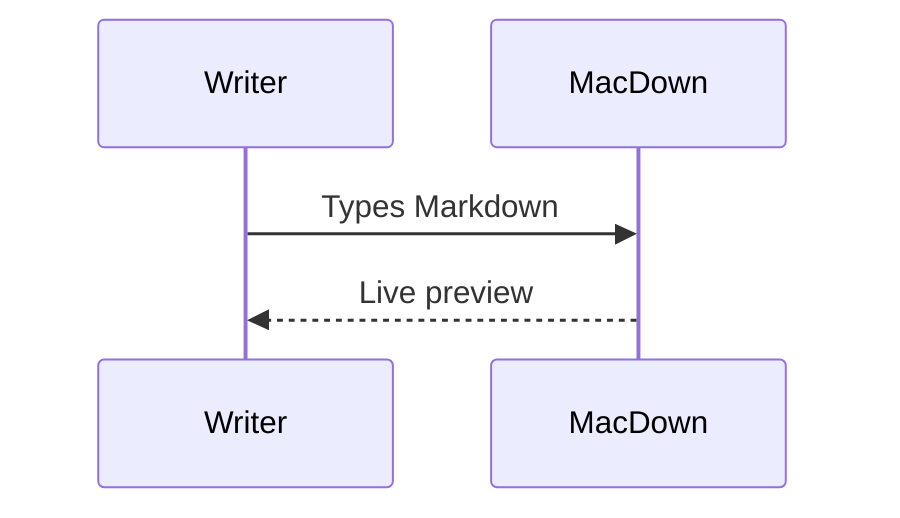
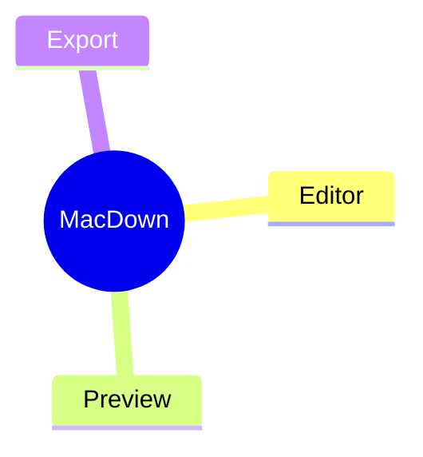
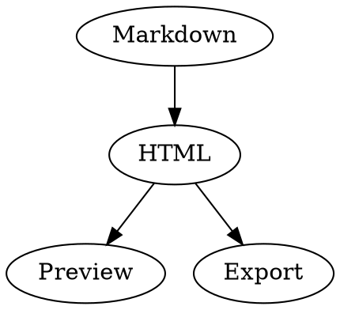

# MacDown

Hello there! I’m **MacDown**, an open source Markdown editor for macOS. You write Markdown on one side, and I show you the formatted result on the other, as you type.

This document is written in Markdown, so it’s also a showcase: every example below is live. Scroll through the preview to see what each one looks like, and through the editor to see how it’s written.

## Markdown and I

**Markdown** is a plain text formatting syntax created by John Gruber, designed to be easy to read and easy to write. Today most people know it through [CommonMark](https://commonmark.org) and [GitHub Flavored Markdown](https://github.github.com/gfm/), and that’s what you can expect from me.

I support all the standard Markdown syntax, plus some popular extensions. Extensions that aren’t standard can be turned on and off in the [**Markdown** settings](#markdown-pane), and the way I render your document is configured in the [**Rendering** settings](#rendering-pane). You’ll find the editor in the [**Editor** settings](#editor-pane), and how I behave as an app in the [**General** settings](#general-pane). Open them all with **MacDown ▸ Settings…** (Command-Comma).

## Writing and saving

By default, edits stay in the window until you save, like a classic Mac document:

* Save with **File ▸ Save** (Command-S) or the **Save** button in the toolbar. The button is enabled whenever there’s something to save, and the dot in the window’s close button shows unsaved changes too.
* **File ▸ Save As…** saves your edits to a new file and leaves the original as it was last saved. **File ▸ Duplicate** opens a copy with your edits.
* If you close a window or quit with unsaved changes, I ask: **Save** (or **Save and Quit**), **Discard**, or **Cancel**.
* Prefer saving as you type? Turn on **Save changes automatically** in the [**General** settings](#general-pane).

## The Basics

Before I tell you about all the extra syntax and capabilities I have, here are the basics of standard Markdown. If you already know them, skip to the [standard extensions](#standard-extensions).

### Paragraphs and Line Breaks

Paragraphs are separated by a blank line. Lines next to each other are joined into one paragraph.

To force a line break, end a line with two spaces.

* This two-line bullet
won’t break

* This two-line bullet  
will break

Here is the code (the second item ends its first line with two spaces):

```
* This two-line bullet
won’t break

* This two-line bullet  
will break
```

### <a name="emphasis"></a>Emphasis

**Strong**: `**Strong**` or `__Strong__` (Command-B)  
*Emphasize*: `*Emphasize*` or `_Emphasize_` (Command-I)  
~~Strikethrough~~: `~~struck through~~` gives ~~struck through~~ (Command-Hyphen)  
***Both***: `***Both***`  
<u>Underline</u>: `<u>Underline</u>` (Command-U; Markdown has no underline syntax, so I use HTML)

Emphasis works inside words too: `So A*maz*ing` gives So A*maz*ing. That goes for underscores as well, so snake_case_name shows *case* emphasized; escape the underscores (`snake\_case\_name`) to keep them.

### Headers (like this one!)

	Header 1
	========

	Header 2
	--------

or

	# Header 1
	## Header 2
	### Header 3
	#### Header 4
	##### Header 5
	###### Header 6

**Format ▸ Convert To** turns the current line into a header (Command-1 to Command-6) or back into a paragraph (Command-0).

#### A level 4 header

##### A level 5 header

###### A level 6 header

### Links and Email

#### Inline

Put angle brackets around a URL or an email address and it becomes clickable: <https://commonmark.org> and <someone@example.com>  
`<https://commonmark.org>` and `<someone@example.com>`

Link some text like this: [CommonMark](https://commonmark.org "The CommonMark site")  
`[CommonMark](https://commonmark.org "The CommonMark site")` (the title is optional)

Links can point to other files, relative to this document: `[My notes](notes.md)`. Following a link to a Markdown file opens it in MacDown. With **Automatically create files for link targets** on, a link to a file that doesn’t exist yet creates it.

#### Reference style

Sometimes long URLs make the text hard to read, or you want to keep all your URLs together.

Make [a link][arbitrary_id] `[a link][arbitrary_id]`, then on its own line anywhere else in the file:  
`[arbitrary_id]: https://commonmark.org "Title"`

If the link text itself would make a good id, you can link [like this][] `[like this][]`, then on its own line anywhere else in the file:  
`[like this]: https://spec.commonmark.org`

[arbitrary_id]: https://commonmark.org "Title"
[like this]: https://spec.commonmark.org

### Images

#### Inline


``

Paths are relative to the document, so `` shows an image next to your file.

#### Reference style

![The Markdown mark again][markdown-mark]

`![Alt Image Text][image-id]`  
on its own line elsewhere:  
`[image-id]: path/or/url/to.jpg "Optional Title"`

[markdown-mark]: data:image/svg+xml;base64,PHN2ZyB4bWxucz0iaHR0cDovL3d3dy53My5vcmcvMjAwMC9zdmciIHdpZHRoPSIyMDgiIGhlaWdodD0iMTI4IiB2aWV3Qm94PSIwIDAgMjA4IDEyOCI+PHJlY3Qgd2lkdGg9IjE5OCIgaGVpZ2h0PSIxMTgiIHg9IjUiIHk9IjUiIHJ5PSIxMCIgc3Ryb2tlPSIjMDAwIiBzdHJva2Utd2lkdGg9IjEwIiBmaWxsPSJub25lIi8+PHBhdGggZD0iTTMwIDk4VjMwaDIwbDIwIDI1IDIwLTI1aDIwdjY4SDkwVjU5TDcwIDg0IDUwIDU5djM5em0xMjUgMGwtMzAtMzNoMjBWMzBoMjB2MzVoMjB6Ii8+PC9zdmc+ "The Markdown mark"

**Format ▸ Image** (Command-Shift-I) and **Format ▸ Link** (Command-Shift-K) insert the syntax around your selection.

### Lists

* Lists must be preceded by a blank line (or block element)
* Unordered lists start each item with a `*`
- `-` works too
+ and so does `+`
	* Indent a level to make a nested list
		1. Ordered lists are supported.
		2. Start each item (number-period-space) like `1. `
		42. It doesn’t matter what number you use, I will render them sequentially
		1. So you might want to start each line with `1.` and let me sort it out

Here is the code:

```
* Lists must be preceded by a blank line (or block element)
* Unordered lists start each item with a `*`
- `-` works too
+ and so does `+`
	* Indent a level to make a nested list
		1. Ordered lists are supported.
		2. Start each item (number-period-space) like `1. `
		42. It doesn’t matter what number you use, I will render them sequentially
		1. So you might want to start each line with `1.` and let me sort it out
```

When you press Return in a list, I continue it for you (and number the next item). Press Return on an empty item to end the list. **Format ▸ Unordered List** (Command-Shift-U) and **Format ▸ Ordered List** (Command-Shift-O) turn lines into list items; **Shift Right** and **Shift Left** (Command-] and Command-[) change the nesting level.

### Block Quote

> Angle brackets `>` are used for block quotes.  
Technically not every line needs to start with a `>` as long as
there are no empty lines between paragraphs.  
> Looks kinda ugly though.
> > Block quotes can be nested.  
> > > Multiple Levels
>
> Most Markdown syntax works inside block quotes.
>
> * Lists
> * [Links][arbitrary_id]
> * Etc.

Here is the code:

```
> Angle brackets `>` are used for block quotes.  
Technically not every line needs to start with a `>` as long as
there are no empty lines between paragraphs.  
> Looks kinda ugly though.
> > Block quotes can be nested.  
> > > Multiple Levels
>
> Most Markdown syntax works inside block quotes.
>
> * Lists
> * [Links][arbitrary_id]
> * Etc.
```

**Format ▸ Blockquote** (Command-Shift-B) quotes the selected lines.

### Inline Code

`Inline code` is indicated by surrounding it with backticks (Command-K):  
`` `Inline code` ``

If your ``code has `backticks` `` that need to be displayed, you can use double backticks:  
```` ``Code with `backticks` `` ````  (mind the spaces preceding the final set of backticks)

### Block Code

If you indent at least four spaces or one tab, I’ll display a code block.

	print('This is a code block')
	print('The block must be preceded by a blank line')
	print('Then indent at least 4 spaces or 1 tab')
		print('Nesting does nothing. Your code is displayed Literally')

I also know how to do something called [Fenced Code Blocks](#fenced-code-block), which I will tell you about later.

### Horizontal Rules

If you type three asterisks `***`, three dashes `---` or three underscores `___` on a line of their own, I’ll display a horizontal rule:

***

### Escaping

Put a backslash in front of a character that would otherwise format: \*not emphasized\*, \# not a header, \[not a link\](nowhere).  
`\*not emphasized\*, \# not a header, \[not a link\](nowhere)`

### HTML

Markdown lets you mix in HTML when you need it: press <kbd>Command</kbd>-<kbd>S</kbd> to save; H<sub>2</sub>O; E = mc<sup>2</sup>; &copy; and &rarr; are HTML entities.  
`<kbd>Command</kbd>-<kbd>S</kbd>`, `H<sub>2</sub>O`, `E = mc<sup>2</sup>`, `&copy;`, `&rarr;`

<!-- This is an HTML comment. It doesn’t appear in the preview. -->

HTML comments, like the one in the editor above this line, don’t appear in the preview. **Format ▸ Comment** (Command-/) comments out the selection.

## <a name="standard-extensions"></a>Standard Extensions

These are part of [GitHub Flavored Markdown](https://github.github.com/gfm/) and always on: tables, fenced code blocks, strikethrough (see [Emphasis](#emphasis)), footnotes, task lists and front-matter.

### Table

This is a table:

First Header  | Second Header
------------- | -------------
Content Cell  | Content Cell
Content Cell  | Content Cell

You can align cell contents with syntax like this:

| Left Aligned  | Center Aligned  | Right Aligned |
|:------------- |:---------------:| -------------:|
| col 3 is      | some wordy text |         $1600 |
| col 2 is      | centered        |           $12 |
| zebra stripes | are neat        |            $1 |

The left- and right-most pipes (`|`) are only aesthetic, and can be omitted. The spaces don’t matter, either. Alignment depends solely on `:` marks.

### <a name="fenced-code-block"></a>Fenced Code Block

This is a fenced code block:

```
print('Hello world!')
```

You can also use tildes (`~`) instead of backticks (`` ` ``):

~~~
print('Hello world!')
~~~

Add a language name after the opening fence, and with **Syntax highlighted code block** on in the [**Rendering** settings](#rendering-pane) (on by default), I color the code:

```swift
struct Greeting {
    let name: String
    func say() -> String { "Hello, \(name)!" }
}
```

```javascript
const greet = (name) => `Hello, ${name}!`;
console.log(greet("world"));
```

```python
def greet(name: str) -> str:
    return f"Hello, {name}!"
```

I know hundreds of languages, including common aliases such as `js`, `py`, `sh` and `objc`.

### Footnotes

Write a footnote reference like this[^1], and the footnote itself anywhere in the document[^note].

`like this[^1]` … `[^1]: The footnote text.`

[^1]: The footnote text. Footnotes collect at the end of the document.

[^note]: You don’t have to use a number. Arbitrary labels like `[^note]` work too, but they *render* as numbered footnotes, in the order they’re referenced.

### Task Lists

`[ ]` and `[x]` at the start of a list item become checkboxes:

1. [x] I can render checkbox list syntax
	* [x] I support nesting
	* [x] I support ordered *and* unordered lists
2. [ ] I don’t support clicking checkboxes directly in the preview

```
1. [x] I can render checkbox list syntax
	* [x] I support nesting
	* [x] I support ordered *and* unordered lists
2. [ ] I don’t support clicking checkboxes directly in the preview
```

### Jekyll Front-matter

I display Jekyll-style front-matter as a table. Put it at the very beginning of the file, fenced with `---`:

```
---
title: "MacDown is my friend"
date: 2014-06-06 20:00:00
tags: [markdown, notes]
---
```

## <a name="markdown-pane"></a>The Markdown Settings

**MacDown ▸ Settings… ▸ Markdown** turns on syntax that isn’t standard Markdown. It’s all off by default, because other Markdown programs won’t show it the same way. Each line shows the markup, then a live example: turn the setting on to see it format.

Setting             | Markup                    | Result when on        |
--------------------|---------------------------|-----------------------|
Highlight           | `==So good==`             | <mark>So good</mark>  |
Superscript         | `x^2`, `hoge^(fuga)`      | x<sup>2</sup>, hoge<sup>fuga</sup> |
Autolink            | `https://example.com`     | <https://example.com> |
Smart punctuation   | `"Quotes" -- and ...`     | “Quotes” – and …      |

Live examples:

* **Highlight** (Command-Equals): ==highlighted==
* **Superscript**: y^3 and 10^(-6)
* **Autolink**: https://example.org and hello@example.org
* **Smart punctuation**: "Curly quotes," 'single quotes,' en -- dash, em --- dash, and an ellipsis...

**Smart punctuation** turns straight quotes, `--`, `---` and `...` into typographer’s quotes, dashes and ellipses, but never inside code.

## <a name="rendering-pane"></a>The Rendering Settings

This is where I keep the settings for how I render and style your document in the preview: **MacDown ▸ Settings… ▸ Rendering**.

### CSS

Choose the stylesheet the preview uses (*GitHub2* by default). The folder button reveals the Styles folder in `~/Library/Application Support/MacDown`, where you can edit the styles or add your own `.css` files; the reload button picks up your changes. **Default path** is the folder that relative links and images resolve against in documents that haven’t been saved yet.

### Syntax Highlighting

*Syntax highlighted code block* (on by default) colors [fenced code blocks](#fenced-code-block) that name a language, with a choice of themes.

*Show line numbers* numbers each line of highlighted code.

*Accessory* adds a label to each code block:

* **None** (the default)
* **Language name** shows the block’s language.
* **Custom** shows your own label, written after the language and a colon:

```swift:Greeting.swift
print("This block is labeled Greeting.swift with Accessory set to Custom")
```

````
```swift:Greeting.swift
print("This block is labeled Greeting.swift with Accessory set to Custom")
```
````

### Diagrams

#### Mermaid

*Mermaid* (on by default, with syntax highlighting) draws [Mermaid](https://mermaid.js.org) diagrams from code blocks marked `mermaid`:







If a diagram has a mistake, I show the error under its source instead of a picture.

#### Graphviz

*Graphviz* (off by default) draws graphs from code blocks marked `dot` (or `neato`, `fdp`, `circo`, `twopi` and `osage` for other layouts):



### TeX-like Math Syntax

*TeX-like math syntax* (off by default) renders math with MathJax.[^math] I can do inline math like this: \\( 1 + 1 \\) or this (in MathML): <math><mn>1</mn><mo>+</mo><mn>1</mn></math>, and block math:

\\[
    A^T_S = B
\\]

$$
\int_0^1 x^2 \, dx = \frac{1}{3}
$$

or (in MathML)

<math display="block">
    <msubsup><mi>A</mi> <mi>S</mi> <mi>T</mi></msubsup>
    <mo>=</mo>
    <mi>B</mi>
</math>

With *Use dollar sign ($) as inline delimiter* on too, $e^{i\pi} + 1 = 0$ works inline. It’s a separate setting because dollar signs are common in ordinary text, like $1600 in the table above.

### Table of Contents

*Detect table of contents token* (off by default) replaces a paragraph containing only `[TOC]` with a table of contents built from the document’s headers. With the setting on, here’s this document’s:

[TOC]

### Render Newline Literally

Normally I require you to put two spaces and a newline at the end of a line to create a line break. With *Render newline literally* on, every newline in a paragraph becomes a line break. Markdown that looks lovely here might look funky in other programs, though.

### Scale Preview

*Scale preview based on editor font size* zooms the preview along with the editor’s font size.

## <a name="general-pane"></a>The General Settings

This is where I keep settings for how I behave: **MacDown ▸ Settings… ▸ General**.

* **Update preview automatically as you type** (on by default). Turn it off to update the preview only when you choose **View ▸ Render Markdown** (Command-R).
* **Sync preview scrollbar when editor scrolls** (on by default) keeps the preview lined up with the editor. Scroll either one, and the other follows.
* **Put editor on the right** swaps the editor and the preview.
* **Show word count** shows a count in the corner of the editor. Click it to choose words, characters, or characters without spaces.
* **Ensure open document on launch** opens an empty document when I start without one.
* **Automatically create files for link targets**: following a link to a file that doesn’t exist creates it.
* **Save changes automatically** saves your edits as you type, instead of when you save (see [Writing and saving](#writing-and-saving)).

## <a name="editor-pane"></a>The Editor Settings

This is where I keep settings for the editing pane: **MacDown ▸ Settings… ▸ Editor**.

### Styling

* **Base font**, **Theme**, **Text insets**, **Line spacing**, and **Limit editor width** set how the editor looks.
* My editor colors your Markdown as you type, using the theme you choose. Some themes come with me (courtesy of [Mou](http://mouapp.com)’s creator, Chen Luo), and you can edit them or add your own: the folder button reveals the Themes folder in `~/Library/Application Support/MacDown`, and the reload button picks up changes. Theme files use the `.style` extension.

### Behavior

* **List marker** is the bullet I insert for unordered lists: `*`, `+` or `-`.
* **Automatically insert line prefix for the current block** continues lists and block quotes when you press Return.
* **Auto-increment numbering in ordered lists** numbers new ordered list items.
* **Insert spaces instead of tabs** for the Tab key.
* **Auto-complete matching characters** closes brackets and quotes, and wraps a selection in them.
* **⌘← jumps to first non-whitespace character in line** skips indentation.
* **Scroll past end** lets the last line scroll up to the middle of the window.
* **Ensure newline at end of file on save** adds a final newline to the saved file.

## Keyboard Shortcuts

Action | Shortcut
-------|---------
Strong | Command-B
Emphasize | Command-I
Underline | Command-U
Strikethrough | Command-Hyphen
Highlight | Command-Equals
Inline Code | Command-K
Comment | Command-/
Link | Command-Shift-K
Image | Command-Shift-I
Header 1–6, Paragraph | Command-1 to Command-6, Command-0
Unordered List, Ordered List | Command-Shift-U, Command-Shift-O
Blockquote | Command-Shift-B
Shift Right, Shift Left | Command-], Command-[
Render Markdown | Command-R
Hide or Restore Preview Pane | Command-Shift-H
Hide or Restore Editor Pane | Command-Shift-E
Editor and preview side by side (1:1) | Command-Shift-0
Copy HTML | Command-Option-C
Export HTML, Export PDF | Command-Option-E, Command-Option-P
Print | Command-P

## Sharing Your Document

* **File ▸ Export ▸ HTML…** saves a web page, optionally with its styles and highlighting included so it looks the same anywhere. **File ▸ Export ▸ PDF…** saves a PDF.
* **File ▸ Print…** prints the formatted document.
* **Copy HTML** in the toolbar copies the HTML of your document.

The preview, print, export and Copy HTML all use the same formatting.

## The Terminal

The **Terminal** settings install the `macdown` command:

```
macdown notes.md other.md     # open files
cat notes.md | macdown        # open piped text as a new document
```

Other apps can open a file in me with a URL: `x-macdown://open?url=file:///path/to/notes.md`.

## Plug-ins

Plug-ins are bundles with the `.plugin` extension in `~/Library/Application Support/MacDown/PlugIns`. They appear in the **Plug-ins** menu.

## Hidden Preference

You can see the HTML behind a preview by enabling the built-in WebKit developer tools for MacDown in a terminal window:

```
defaults write io.github.levous.macdown-swift WebKitDeveloperExtras -bool true
```

Then reopen your document (or relaunch MacDown) and select “Inspect Element” in the right-click context menu inside the preview pane.

This is the exact same inspector you find in Safari if you turn on the developer tools.

## Hack On

That’s about it. Thanks for listening. MacDown is open source; see **Help ▸ Contributing to MacDown** if you’d like to help.

Happy writing!


[^math]: MathJax is loaded from the internet, so math needs an internet connection.
