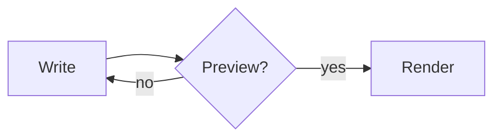
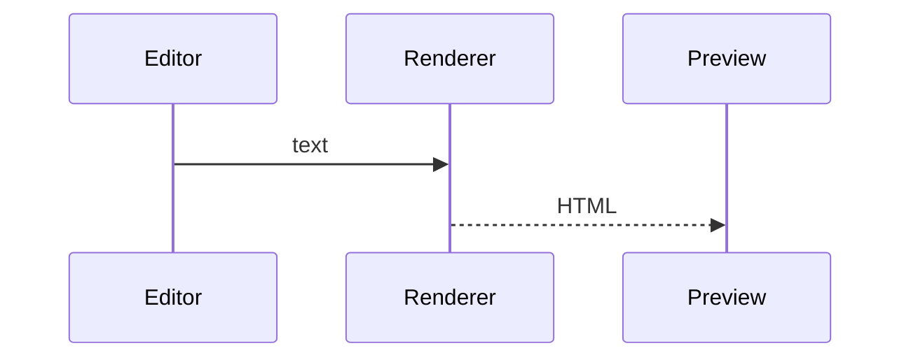
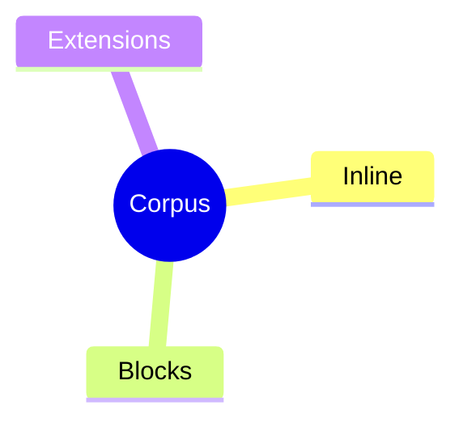
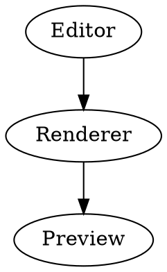

# Diagrams

```mermaid
flowchart LR
    A[Write] --> B{Preview?}
    B -- yes --> C[Render]
    B -- no --> A
```

```mermaid
sequenceDiagram
    Editor->>Renderer: text
    Renderer-->>Preview: HTML
```

```mermaid
mindmap
  root((Corpus))
    Inline
    Blocks
    Extensions
```

```dot
digraph G {
    Editor -> Renderer -> Preview;
}
```

```mermaid
this is not valid mermaid
```
